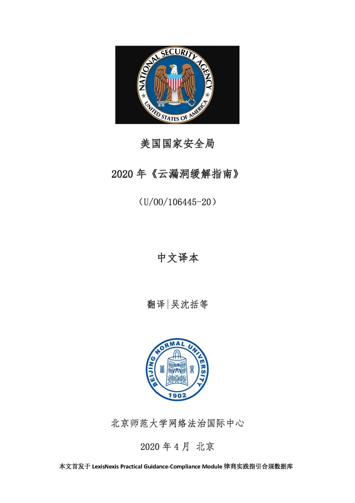
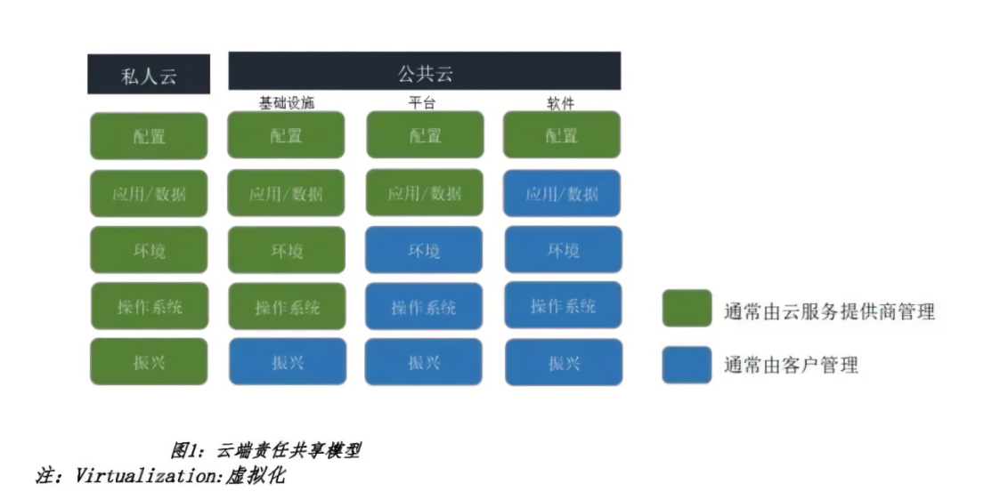
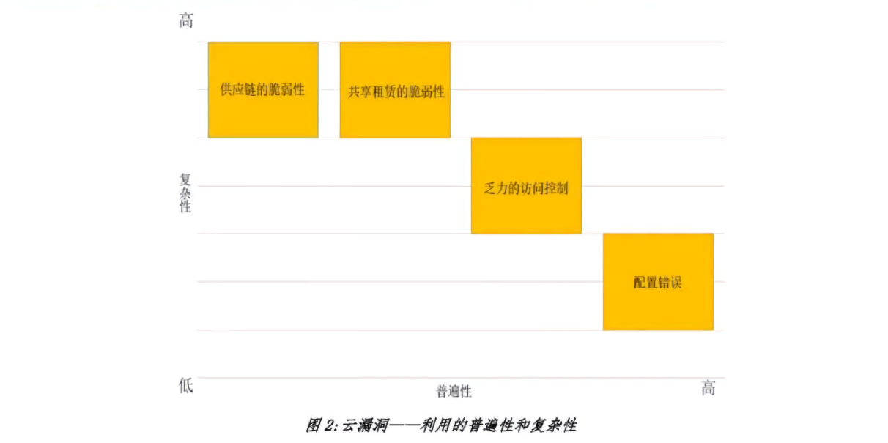

<h1 align="center">美国国家安全局 | 网络信息安全<h1>

## 云漏洞缓解指南

虽然谨慎地采用云技术可以提高组织的安全态势，但云服务可能会导致一些风险出现，这些风险是组织在采购过程中和在云端操作时应该理解和解决的。在将资源转移到云端时，全面评估安全影响将有助于确保持续的资源可用性并降低敏感信息暴露的风险。为了实施有效的缓解措施，组织应该像在内部环境中一样，考虑云资源的网络风险。

本文件将云漏洞分为四类（配置错误、访问控制不当、共享租赁漏洞和供应链漏洞），其中包含了绝大多数已知漏洞。云
客户在减少配置错误和访问控制不当方面具有关健作用，但组织也可以采取措施保护云资源免受共享租赁和供应链漏洞的
攻击。通过提供每类漏洞的描述以及最有效的缓解措施，可以帮助组织锁定其云资源。通过采取基于风险的云技术方法，
组织可以安全地受益于云的广泛功能中。

本指南供组织领导和技术人员使用。组织领导层可以参考云组件部分、云威胁参与者部分及云漏洞和缓解概述，了解云安
全原则。技术和安全专业人员应当发现该文件帮助解决云服务采购期间和之后的云安全问题。

### 云组件
云架构并不标准化，而且每个云服务提供商（CSP）实现基础云服务的方式都不同。理解CSP的云实现应该是客户在云服务采购期间风险决策的一部分。下面四种云架构服务在大多数云中都很常见：
* 身份和访问管理(IdAM)：IdAM是指为保护客户对其资源的访问而实施的控制，以及CSP用于保护对后端云资源的访
  问的控制。安全的客户和云后端IdAM，包括实施和审计两部分，对于保护云客户的资源至关重要。
* 计算：云通常依赖虚拟化和容器化措施来管理和隔离客户计算的工作负载。无服务器计算(Serverless computing)是
  云计算资源的动态分配，用于运行客户代码，它是建立在虚拟化或容器化的基础上的，具体取决于云服务。
  * 虚拟化：是一种云骨干技术，不仅适用于客户工作负载，也适用于云架构本身。虚拟化是一种支持技
    术，它在云中为存储和网络提供隔离。虚拟化通常用于实现和保护内部云节点。
  * 容器化（containerization）：是一种更轻量级的技术，通常在云中用于管理和隔离客户工作负载。和虚拟
    化相比，隔离技术的容器化更不安全，因为它具有共享的内核特性，但是CSPs提供的技术有助于解决容
    器化的安全缺陷。
* 网络：客户网络的隔离是云的关键安全功能。此外，云网络必须在整个云架构中实施控制，以保护客户云资源免受
  内部威胁。软件定义网络通常在云中使用，以便在逻辑上分离客户网络并实现云中的骨干网络。
* 存储（对象、版块和数据庫记录）：客户数据在逻辑上与云节点上的其他客户数据分离。必须存在安全机制，以
  确保客户数据不会泄露给其他客户，并保护客户数据免受内部威胁。

#### 云加密和密钥管理

虽然不是云架构的基本组件，但加密和密钥管理(KM)是保护云中信息的一个关键方面。虽然CSP使用加密手段（以及其他控制）来保护客户数据的某些方面不受其他客户和CSP员工的影响，但云客户应该了解他们为进一步保护数据所拥有的选项。了解数据敏感度要求对于构建云加密和密钥管理策略至关重要。

客户可以利用云服务提供商提供的加密技术和密钥管理服务。基于云的密钥管理服务旨在与其他云服务集成，从而减少保
护和处理云数据所需的客户开发量。基于云的密钥管理服务能够向客户提供关于密钥创建、销毁和使用的审计信息。除了
基于软件的解决方案外，许多云服务提供商还提供硬件安全模块（HSM）服务，以保护云中的客户密钥。客户还可以选择向云提供外部生成的密钥以用于加密（自带密钥）。一些云服务提供商提供的加密技术和密钥管理的解决方案经过认证可以保护敏感，但非机密的国防部信息。

客户还可以使用客户工具或第三方工具在云端之外执行加密和密钥管理。将加密和密钥管理放在云外可以确保客户数据永
远不会暴露给云管理员。此外，如果云服务提供商的多租户控件出现故障，预加密数据将受到保护，以防暴露给其他客
户。此解决方案造成的后果是：(l)客户或第三方供应商必须在其系统的应用程序或数据管理层中建立加密功能，并对密
钥管理负贵，这需要大量的专业知识和努力；（2）此解决方案没有与其他云服务提供商的服务很好地集成，这就要求客户将他们的外部应用程序或服务与云端集成，并限制对可视化、人工智能和其他数据层服务的采用。例如，预加密的数据通常无法在云中搜索或操作。

#### 共担云端安全责任

云服务提供商和云客户共同承担独立且交叉的职责，以确保服务和存储在公共云中的敏感数据的安全。云服务提供商负责
保护云基础设施，并实施逻辑控制以分离客户数据。组织管理员通常负责配置应用程序级别的安全性（例如对数据授权的
访问控制）。许多云服务提供商提供了云安全配置工具和监控系统，但云客户负贵根据组织安全的需求配置服务。共同责任会影响日常操作（如修补程序管理）和异常事件（如安全事件响应）。具体责任因云服务提供商、云服务类型（如基础设施即服务[laaS]与平台即服务[PaaS]）和特定产品（如托管虚拟机与非托管虚拟机）而异。图1显示了这些职责的通用映射。

共同责任的考虑因素包括：

* 威胁检测：虽然云服务提供商通常负责检测对底层云平台的威胁监测，但客户有责任检测对自己云资源的威胁。云服
  务提供商和第三方可以提供基于云的工具，来帮助客户进行威胁检测。
* 事件响应：云服务提供商具有独特的地位，可响应云基础设施的内部事件，并承担相应责任。客户云环境的内部
  事件通常由客户承担责任，但云服务提供商可为事件响应团队提供支持。
* 修补/更新：云服务提供商负责确保其云产品的安全性，及在其权限范围内迅速修补软件，但通常不修补客户管理
  软件（例如：laaS产品的操作系统）。因此，客户应警惕地部署补丁，以缓解云端的软件漏洞。在某些情况下，云
  服务提供商可提供管理解决方案，并于方案中执行操作系统的修补。

#### 云威胁行为者

威胁行为的参与者可能会针对云端和传统系统架构中相同类型的弱点。本节重点关注特定云活动，但管理员应注意到传统战略仍然适用。例如，未经修补的云端网络应用程序与从本地网络提供服务的应用程序承担着相似的妥协风险。以下威胁行为者与云计算相关：

##### 恶意CSP管理员

* 利用特权凭证或职位访问、修改或销毁存储在云平台上的信息；
* 利用特权证书或职位修改云平台，以便访问连接或消耗云资源的网络；

##### 恶意客户云管理员

* 利用特权凭证访问、修改或销毁存储在云平台上的信息；

##### 网络犯罪分子及/或由国家资助的行为体

* 利用云体系结构或配置中的弱点来获取敏感数据或消耗云资源，牺牲受害者的利益；
* 利用薄弱的、基于云端的认证机制去获取用户证书（例如，密码喷射攻击）；
* 利用受损凭证或不正当访问权限去获取云资源；
* 获得对云环境的访问特权，破坏租户资源；
* 利用组织网络和云资源问的信任关系，从云端转向受保护的网络，反之亦然；

##### 未经培训或疏忽的客户云管理员

* 无意间暴露敏感数据或云资源。

### 云漏洞及缓解措施
云漏洞与传统结构中的漏洞类似，但共享租赁的云特性及潜在的普遍访问会增加其被利用的风险。以下列出的漏洞类别在发现和利用漏洞的普遍性和最低攻击者复杂度方面有所相同。以下每部分会展示一个云漏洞类别、提供现实世界的示例、评估漏洞的普遍性、评定攻击者的复杂性，并讨论缓解措施。

减轻云漏洞是CSP和客户组织之间的共同责任。对于组织在向云转换和维护云资源方面的成功，关键是来自明智的领导层的支持，这使正确的治理、预算和监督得以被确保。在这种支持下，管理员能够有效地减轻云资源的负担。云技术发展迅
速，因而监督成为一项复杂的任务。

组织需要与组织规模相称的专用资源，以确保云中具备充分保护。此外，客户应该与他们的CSP合作，了解供应商特有的对策及其对风险的影响。

#### 配置错误

普遍性：广泛；攻击者复杂程度：低

尽管CSP经常提供帮助管理云配置的工具，云资源的错误配置仍然是最普遍的云漏洞，它可以被用来访问云数据和进行服
务。错误配置通常由云服务策略[云服务策略是在软件中实现的技术控制，用于定义云服务如何交互。]误解共享责任引
起，其影响从拒绝服务到帐户妥协不等。CSP的快速创新创造了新的功能，但也增加了安全地配置组织的云资源的复杂性。

##### 滥用错误配置的例子

* 2017年5月，一家大型国防承包商在可公开访问的云存储中暴露了敏感的NGA数据和认证凭证；
* 2017年9月，一名安全研究员发现，所有公共云用户都可以访问CENTCOM的数据；
* 2019年9月，一个研究团队在可公开访问的Elasticsearch数据库中发现了国防部人员的敏感旅行细节。

适当的云配置始于基础设施设计和自动化。在最初的设计和规划过程中，应该应用保障原则，比如最低限度的特权和纵深
防御。有序的云管理也是安全网络环境的关键。实施这些原则的技术控制因CSP而异，但通常包括云服务策略、加密、访问控制列表（ACL）、应用程序网关、入侵检测系统(IDS)、web应用程序防火墙（WAF）和虚拟专用网络(VPN)等。设计与操作良好的云体系结构应包括防止配置错误或提醒管理员配置不当的控件。DoD组织可以利用DoD云计算安全要求指南(CCSRG）[4]提供基于数据敏感性的要求集，并应主动应用针对特定用例定制的其他控件，充分利用云自动化来监视和确保安全性。最后需提及的是，这些控件和配置不应是静态设置，而应与组织的云技术和风险管理一起进化升级。

为便于组织对最低权限的强制实施，管理员应做到以下几点

* 通过云服务第略，防止用户在未进行任务认证的情况下公开共享数据；
* 使用云或者第三方工具检测云服务策略中的错误配置；
* 在零信任模式状态下，限制对云资源的直接或间接访问；
* 使用云服务第略确保资源默认为私有资源；
* 使用自动工具审核访问日志，以识别过度曝光的数据：
* 限制敏感数据并将其置入待批准存储，使用数据丢失防护方案实施这些限制。

此外，为了实施纵深防御，管理员应当：

* 确保为创建或修改云服务策略的个人提供适当的CSP专业培训；
* 使用有力的加密方法，并正确配置、管理和监控密钥管理系统，在静态和传输过程中实施数据加密；
* 遵守适用的标准（例如，csP指南、互联网安全基准中心、DoDCCSRG)；
* 在云系统中配置软件以自动更新；
* 控制虚拟机映像的选择以获得强化后的基线，并启用可预测的网络防御；
* 控制和审核云服务策略和IdAM更改；
* 确保在所有级别日志记录的启用（例如，用户平台活动、网络流日志、SaaS/PaaS活动），以掌握现实环境，特别是临时资源，并确保日志的不可移动存储；
* 尽可能将传统安全实践应用于云（例如，为基于云的端点启用端点检测和响应[CEDR]）；
* 利用CSP中新出现的安全功能来检测来自特殊位置的威胁；
* 遵循最佳做法来防止特权账户的滥用（例如职责分离，双人控制）；
* 建立配置更改和安全事件的自动连续监视；
* 关联来自混合或多云环境的日志；
* 建立能够满足组织对于冗余、可用性、性能、数据所有权/主权、物理安全、事件处理和云基础架构透明度需求的合同；
* 控制和审核云服务第略和IdAM更改；
* 识别和铲除不破坏组织控制的Shadow IT。

最后，为了实现对云应用的有序过渡，管理员应：

* 实现CSP服务的现代化并充分利用而非对遗留系统的“升级和转移”；
* 确保过渡期有合适的定义、资助、审查，并在正确的领导下进行；
* 改进体系结构和流程，以整合新功能，了解风险变化；
* 了解您的数据及其在整个系统中的流动方式；
* 评估传统IT操作或基础设施可以合并到云部署中的领域；
* 使用CSP工具或技术（如以基础结构为代码）来降低配置错误的风险。

#### 访问控制不当

普遍性：广泛；攻击者复杂程度：中等

当云资源使用弱身份认证/授权方法或包括绕过这些方法的漏洞时，就会出现糟糕的访问控制。访问控制机制的弱点可能使攻击者提升特权，从而损害云资源。

访问控制不当的例子：

* 在2019年10月：CSP报告了网络攻击，黑客通过发送到单因素身份验证电子邮件账户的密码重置消息，破坏了使用多因素身份验证的云帐户；
* 在2018年3月，美国联邦调查局(FBI)报告称，总部位于伊朗的Mabna集团通过使用基于云的电子邮件服务备用单因素协议绕过多因素身份验证。

强制执行强身份验证和授权协议可以缓解访问控制不当的情况。下面重点介绍一些确保强访问控制的建议：

* 采用具有强因素的多因素身份验证，并需要定期重新认证；
* 使用弱认证禁用协议；
* 限制对云资源的访问以及云资源之间的访问，且所需状态为零信任模型；
* 尽可能在云资源上使用基于云的访问控制（例如，虚拟机之间使用然CSP管理的身份验证）；
* 使用自动化工具来审核访问日志以解决安全问题；
* 在可能的情况下，对密码重置强制执行多因素身份验证；
* 请勿在软件版本控制系统中包含API密钥，否则可能会造成密钥意外泄漏。

#### 共享租赁漏洞

普遍性：罕见；攻击者复杂程度：高

云平台由多个软件和硬件组件组成。确定云体系结构中使用的软件或硬件的对象，可以利用漏洞来提升云中的特权。云技术管理程序（即支持虚拟化的软件/硬件）或容器平台中的漏洞在保护云架构和隔离客户工作负载方面发挥着至关重要的作用，因此这些漏洞尤其严重。

虚拟机监控程序漏洞很难被发现和利用，而且代价昂贵，这限制了它们只能被高级攻击者使用。领先的CSP持续扫描虚拟机监控程序代码中的漏洞，并将其虚拟机监控程序提交给模糊测试，以识别和补救漏洞。CSP同样能监视系统日志，以查看是否有任何有关管理程序利用的证据。

容器化虽然是提高性能和可移植性的诱人技术，但在多租户环境中部署之前应仔细考量。容器在共享内核上运行，没有虚拟化提供的抽象层。在云等多租户环境中，容器平台中的漏洞可能使攻击者得以破坏同一主机上其他租户的容器。

虽然在任何主要的云平台上都没有隔离受损的报道，但安全研究人员已经展示了虚拟机管理程序和容器突破：

* 在2017年Pwn2own计算机黑客大赛中，两个团队成功展示了虚拟机监控程序突破攻击，这使攻击者可以在主
  机操作系统中控制执行；
* 在2019年USENIX攻击技术研讨会(WOOT)上，研究人员提出了一条用来逃脱裸机(Type1）虚拟机管理程序上的来宾环境，并获得对主机系统的访问权限的功能的利用；
* 在2019年，容器(container)平台中发现一个漏洞，允许攻击者可以利用该漏洞在容器运行时进行覆盖，并利用此功能访问在同一平台上运行的其他容器。

处理器中的硬件漏洞也可能对云安全产生重大影响。芯片设计中的缺陷可能会通过侧通道攻击导致云中的租户信息受损。尽管这里并没有使用这些或其他硬件漏洞的攻击记录；但在云中使用共享硬件将放大未来漏洞的影响。为了解决这个问题，服务提供商在缓解硬件漏洞方而具有优势，因为它们可以比其他环境更大规模、更为快速地修补其环境。

缓解共享租户漏洞的方法包括使用CSP提供的机制将组织资源与其他云租户分开。这里建议采用以下缓解措施：

* 通过强大的加密方法以及正确配置、管理和监视的密钥管理系统，对静态和传输中的数据进行加密，
* 对于DoD组织，请使用获得DoD CCSRG认证的云服务；
* 对于特别敏感的工作负载，使用专用的、整体的或裸机的例子，来降低对手并置和利用虚拟机监控程序漏洞来获取资源访问权的风险；
* 对于敏感的工作负载，如果可能的话，请使用虚拟化进行隔离而非容器化；
* 在考虑使用云服务（例如无服务器计算）时，应了解底层隔离技术（例如虚拟化，容器化）以及它是否可以减轻预期用途的风险；
* 选择已经根据国家信息保障合作伙伴（NIAP）保护配置文件（PPs）评估了关键组件的云产品，尤其是已针对NIAP
  服务虚拟化PP进行了评估的虚拟机监控程序。

#### 供应链漏洞
普遍性：罕见；攻击者复杂程度：高

云中的供应链漏洞包括内部出现的攻击者以及硬件和软件中故意打开的后门。CSP从全球采购的硬件和软件，并雇用各国的开发人员。第三方软件云组件可能包含开发人员故意插入的漏洞，来破坏应用程序。作为供应商，管理员或开发人员，将代理（Agent）插入云供应链中可能是本土民族国家攻击者破坏云环境的有效方法。

以下是当不特定用于云环境时供应链攻击的一些示例：

* 在ShadowHammer操作中，修改了从实时更新服务器下载的内容以添加恶意功能。尽管有对该软件的分析表明该参与
  者的目标是通过针对MAC地址来攻击特定主机，但仍有50万用户下载了该软件。
* 在2019年12月，两个恶意的Python程序包索引(PyPI)库被发现是用来从开发人员不经意问安装凭据的系统中窃取凭证。

缓解针对云平台的供应链攻击主要是CSP的责任，云供应商意识到供应链风险，并通过软件测试和硬件验证来寻找后门的迹象。CSP通过诸如角色分离，针对特别敏感操作的双方诚信和警报可疑管理员活动等控制措施来减轻内部攻击者的风险。
为了增强组织抵御供应链受损的防御能力，管理员们应做到：

* 通过强大的加密方法以及正确配置、管理和监视的密钥管理系统，对静态和传输中的数据进行加密；
* 根据适用的认证流程（例如针对DoD组件的CCSRG)购买云资源；
* 选择已根据国家信息保障合作伙伴(NIAP)保护配置文件（PPs）评估了关键组件的云产品；NIAP评估可以发现组件中的后门。
* 确保开发和迁移合同规定遵守内部标准或等效流程以减轻供应链风险；
* 控制虚拟机映像的选择，以防止使用不可信的第三方产品，例如恶意云市场产品与CSP讨论特定于供应商的对策，以制定风险决策；
* 遵守适用的标准，利用安全的编码实践，并在企业应用程序的安全性，完整性和弹性方面不断改进。

### 结论

云管理中的风险致使客户不仅要在采购过程中充分考虑是否暴露于威胁和漏洞，而且在一个持续的过程中都要有此考虑，
云服务可以提供许多安全优势，例如能够彻底自动化与安全相关的过程，包括威胁和事件响应。通过仔细的实施和管理，
云功能可以将采用云服务带来的风险最小化，并授权客户利用云安全增强功能。客户应了解他们与CSP在保护云方面的共同责任。CSP可以为客户提供量身定制的对策，以帮助客户加固其云资源。云安全是一个持续的过程，客户应当不断监控他们的云资源，并努力改善其安全状况。

#### 参考文献

略
